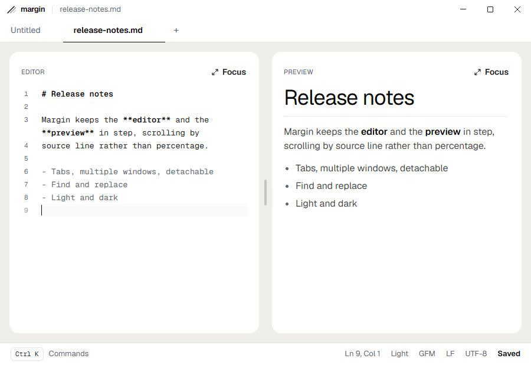

<picture>
  <source media="(prefers-color-scheme: dark)" srcset="docs/wordmark-dark.png">
  
</picture>

A simple cross-platform (macOS + Windows) Markdown editor with a split
editor/preview, source-mapped scroll sync, tabbed documents, and a command
palette.



Above, in order: live preview as you type, the ⌘K palette switching to dark
mode, the edit-history sidebar previewing an earlier version, and an inline
compare against another file on disk.

## Requirements

Node 22 or newer.

## Getting started

```bash
npm install
npm run dev
```

## Features

### Editing and preview

- Split editor and preview with a draggable divider; double-click to reset, drag
  past a pane's minimum to snap into focus view
- Either pane maximizes with `⌘⌥1` / `⌘⌥2` (`Ctrl+Alt+…` on Windows) or its
  Focus link; the same chord returns to split
- Scroll sync by **source line**, not percentage: the panes stay together across
  code blocks and images, where percentage sync visibly drifts
- Markdown syntax highlighting with nested languages inside fenced code blocks
- Three flavors (CommonMark, GFM, GFM + extras), switchable from the footer
- Find and replace in the active document, with regex, case sensitivity and
  whole-word matching; replace-all is a single undo step

### Files

- Open, Save and Save As, with unsaved-changes confirmation on close and quit
- Encoding detected on read and preserved on write: UTF-8 (with or without BOM),
  UTF-16 LE/BE, Windows-1252, ISO-8859-1. "Reopen as…" covers the times the
  guess is wrong, which it will sometimes be
- Line endings preserved: a CRLF file stays CRLF, and mixed files say so
- External-change watching: a file edited underneath a clean buffer reloads
  silently, and one edited underneath unsaved changes asks first
- Recent files, and one document per file; opening a file already open focuses
  it instead of making a second copy that fights the first
- Opt-in auto-save and save-on-exit, off by default and independent of each
  other; an untitled document is never written without being asked

### Tabs, windows and chrome

- Tabs, with a dirty dot that becomes a close button on hover; they reorder by
  dragging and detach into their own window when dragged clear of the strip
- Multiple windows, and Open in New Window
- ⌘K command palette over a single command registry
- A native menu built from the same command catalog the palette uses, so the two
  cannot drift; chords CodeMirror owns are shown but not registered
- Status bar: cursor position, selection length, flavor, EOL, encoding, save state
- Closing the last document leaves a home screen (the mark, New and Open, and
  recent files) rather than an empty window or an unasked-for untitled buffer
- Light and dark, switchable from the footer, applied to chrome, editor, preview
  and the native window buttons in every window at once

### History and compare

- Edit history: every change is journalled as a CodeMirror ChangeSet, coalesced
  on idle and committed on save, with a sidebar listing timestamped versions.
  Restoring one appends to the journal rather than rewriting it, so nothing is
  lost by trying it
- Compare the document against another file on disk or against a version from
  its history, shown as an inline diff. Two files that differ only in their line
  endings show no changes

## Scripts

| Script | What it does |
| --- | --- |
| `npm run dev` | Electron + Vite dev server with HMR |
| `npm run build` | Typecheck, then build main, preload and renderer into `out/` |
| `npm run test` | Vitest |
| `npm run typecheck` | Both TypeScript projects (node and web) |
| `npm run check:deps` | Asserts exactly one copy of `@codemirror/state` |
| `npm run smoke` | Loads the built renderer offscreen and asserts against the live DOM |
| `npm run e2e` | Launches the real app (main process, native menu, file layer) and drives it |
| `npm run perf` | Measures the preview update budget in Chromium |
| `npm run check` | Typecheck, deps, tests, build, smoke, e2e, in that order |
| `npm run dist:win` | NSIS installer |
| `npm run dist:mac` | dmg + zip, universal |

`smoke`, `e2e` and `perf` all need a built `out/`; `check` builds first so the
three that it runs are in the right order. `perf` is deliberately not part of
`check`, because a millisecond budget on a shared CI runner fails for reasons
that have nothing to do with the change under test.

`smoke` and `e2e` are not the same test. Smoke stands up a bare window around the
built renderer with stubbed IPC, so it catches a broken preload, a CSP that
blocks the bundle, or a renderer that throws on mount. `e2e` launches the actual
main process and drives the app through its native menu, which is the only way
the command wiring, the file layer and the quit handshake are exercised for real.

## Continuous integration and releases

Two workflows in `.github/workflows/`:

`ci.yml` runs on every push to `master` and every pull request. It runs the steps
of `npm run check` — typecheck, dependency check, tests, build, smoke, e2e — on
**both** a macOS and a Windows runner, because parity asserted on one platform is
not asserted. On a failure it uploads the screenshots the e2e driver takes at each
step. `perf` is not part of it, for the reason given above.

`release.yml` builds the installers: the universal dmg and zip on macOS, the NSIS
setup executable on Windows. Push a version tag to cut a release —

```bash
git tag v0.1.0 && git push origin v0.1.0
```

— and it checks the tag against the version in `package.json` (they have to
agree, because the installer filenames carry the `package.json` version), builds
both platforms, and attaches the installers to a **draft** GitHub Release for you
to review and publish. Running the workflow manually from the Actions tab builds
the same installers as downloadable workflow artifacts without creating a release.

Neither platform is code-signed. `electron-builder.cjs` sets `identity: null`
while the signing identity is an open question, so macOS users will meet
Gatekeeper and Windows users SmartScreen.

## A note on where history is stored

Edit history is written to the application's data directory, not next to your
files, as plain, unencrypted JSON lines. Opening a sensitive document therefore
leaves a copy of its content in application data, and deleting the document does
not delete that copy.

## Architecture

```
src/
  shared/     branding, IPC contract, wire types
  core/       pure TypeScript, zero Electron: markdown, text, commands
  main/       Electron main: window, security, IPC
  preload/    the entire contextBridge surface
  renderer/   React UI, CodeMirror host, preview
```

Four constraints shape it: the renderer never touches `fs`, `core/` never
imports Electron, one `EditorView` serves N documents, and every preview string
passes through DOMPurify. They are documented in [`CLAUDE.md`](CLAUDE.md) and
specified in [`margin-implementation-plan.md`](margin-implementation-plan.md).

## Security

Markdown files are treated as untrusted input. Raw HTML is disabled in the parser,
all preview HTML passes through DOMPurify, the renderer runs with
`contextIsolation` on and `sandbox` on with no `fs` access, a strict CSP blocks
remote resource loading, and external links open in the system browser rather than
in-app.
